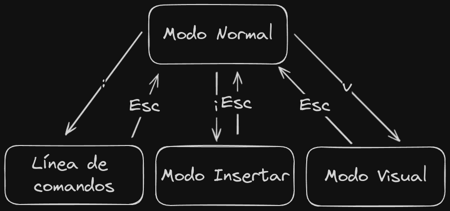

# Vim Tutorial

## Primeros pasos

- Instalar vim.
- Para iniciar vim solo es necesario en la terminal escribir vim y se iniciará el editor.

```bash
vim
```

- Si deseamos abrir un fichero o carpeta en vim solo es necesario escribir la ruta o el nombre del fichero despúes del comando vim.

```bash
vim src/index.js
```

- Para comenzar lo mejor es realizar el tutorial interno de vim que viene imcorporado con el editor ejecutando el script en terminal.

```bash
vimtutor es
```

## Porque VIM

El primer argumento y más recurrente es porque vim mola. Después también es cierto que ayuda a programar de una manera mas rápida al evitar tener que desplazar las manos del teclado de manera tan habitual. Pero en mi opinión ayuda todavía mas en ir directo al grano, cada movimiento en vim se puede realizar en un segundo pulsando no más de seis teclas. Es preciso y agíl, lo que ayuda a enfocarse en el desarollo.

Pongamos un ejemplo:

```js
const sum = (a, b) => {
  if (!a || !b) return;

  return a + b;
};
```

Si deseamos cambiar todo el código dentro de la función sum habría que desplazar la mano al ratón, seleccionar la parte interna de las llaves y a posterior la tecla delete. No es mucho tiempo pero es una acción que se puede repetir varias ocasiones a lo largo del dia.

Como sería pues en Vim. Tan facíl como situar el cursor dentro de las llaves en cualquier punto y pulsar "di{" (delete inner {}).

Vim funciona de una manera, en mi opinión , muy similar a los acordes musicales producidos al ejecutar tres o mas notas de manera casi simultanea.

Dejaré algunos ejemplos de acciones rápidas que se podrían hacer:

| Teclas | Acción                                                    |
| ------ | --------------------------------------------------------- |
| d3j    | Borrar tres líneas hacia abajo (delete 3 bottom)          |
| dt>    | Borrar hasta el siguiente símbolo > (delete until >)      |
| 4w     | Desplazarse cuatro palabras hacia delante (4 words)       |
| cit    | Cambiar el contenido de una tag (change inner tag)        |
| yi(    | Copiar el contenido dentro del paréntesis (yank inner ()) |

## Desventajas de vim

- Su editor de texto es altamente configurable pero eso quiere decir que esta mas pelado que un mileurista a fin de mes. Todo, todo, todo lo tienes que configurar tu. Es cierto que hay un montón de plugins y configuraciones públicas pero es arto complejo llegar a hacerlas tuyas.

- La curva de aprendizaje de vim es prolongada y empinada. Se tarda en memorizar los atajos y en comprender la dinámica detrás de vim.

- Muchos son los editores que tienen algúna extensión o configuración para poder usar vim en ellos pero casi ninguno es capaz de emular todas las características que ofrece el editor original.

## Modos dentro de vim

Dentro de vim existen 4 modos básicos:

1. Modo normal
2. Modo línea de comandos
3. Modo insertar
4. Modo Visual



### Modo normal

Dado que un programador pasa mas tiempo revisando y editando código se tomo este modo como predeterminado. Permite moverse de manera rápida a través de todo el documento y editar porciones.

### Modo línea de comandos

Es un modo especial al que se entra al pulsar ":" y que nos permite ejecutar pequeños comandos dentro del editor como guardar, salir, sustituir,...

### Modo insertar

Vendría a ser el modo habitual de cualquier otro editor donde podemos escribir y borrar código.

### Modo Visual

Es un modo para seleccionar porciones de texto y ejecutar comandos sobre ellas. Se entra al pulsar "v".

## Comandos básicos dentro de vim

Salir de vim:

```bash
:q or :quit
```

Guardar en vim:

```bash
:w or :write
```

Guardar y salir:

```bash
:wq
```

Salir sin guardar:

```bash
:!q
```

## Moverse dentro de vim

Los movimientos básicos son los que se muestran en la imagen.


### WORD vs word

Que es WORD y que es word pues es bastante sencillo. El primer caso incluye los conjuntos de cáracteres con símbolos especiales y el segundo caso solo incluye cáracteres del alfabeto y númericos, además del guión bajo.


Pongamos un ejemplo de como se vería en código

```js
v      vv  vvv     v    vv
console.log('Hello World')
^                  ^
```

En la línea superior se puede ver como se desplazaría el cursor al pulsar solo "w" y en la línea inferior como se comportaría con "W". Esto nos ayuda a ser mas granular y poder movernos a distintas velocidades y de maneras mas precisas por el código.

### Movimientos avanzados dentro de vim

Para moverse dentro de vim existen distintas teclas que nos aportan un desplazamiento muy preciso.

| Tecla | Descripción                                              |
| ----- | -------------------------------------------------------- |
| w     | Se desplaza hacia delante una word                       |
| W     | Se desplaza hacia delante una WORD                       |
| b     | Se desplaza hacia atrás una word                         |
| B     | Se desplaza hacia atrás una WORD                         |
| e     | Se desplaza hacia delante al último cáracter de una word |
| E     | Se desplaza hacia delante al último cáracter de una WORD |
| ge    | Se desplaza hacia atrás al último cáracter de una word   |
| gE    | Se desplaza hacia atrás al último cáracter de una WORD   |
| gg    | Nos lleva al inicio del documento                        |
| G     | Nos lleva al final del documento                         |

Recurso de ayuda para mejorar la movilidad dentro de vim:

[Vim Adventures](https://vim-adventures.com/)

## Recursos para continuar aprendiendo

- Extensión para Vscode que nos ayuda con una amplia introducción a VIM.

[Extensión Learn VIM](https://marketplace.visualstudio.com/items?itemName=vintharas.learn-vim)
