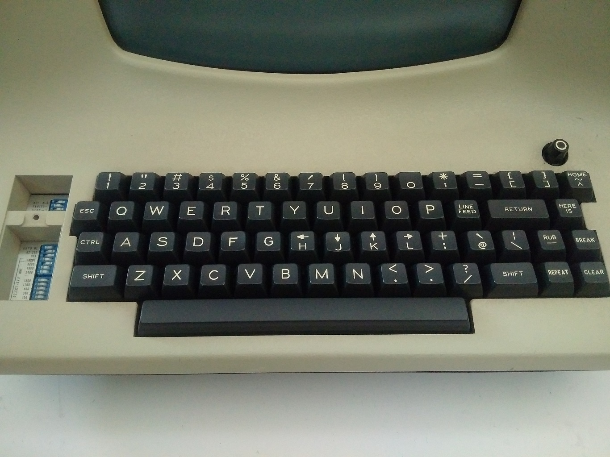

## Tutorial de VIM

- [Tutorial de VIM](#tutorial-de-vim)
- [Historia de VI \& VIM](#historia-de-vi--vim)
- [Primeros pasos](#primeros-pasos)
- [Porque VIM](#porque-vim)
- [Desventajas de vim](#desventajas-de-vim)
- [Modos dentro de vim](#modos-dentro-de-vim)
  - [Modo normal](#modo-normal)
  - [Modo línea de comandos](#modo-línea-de-comandos)
  - [Modo insertar](#modo-insertar)
  - [Modo Visual](#modo-visual)
- [Comandos básicos dentro de vim](#comandos-básicos-dentro-de-vim)
- [Moverse dentro de vim](#moverse-dentro-de-vim)
  - [WORD vs word](#word-vs-word)
  - [Movimientos avanzados dentro de vim](#movimientos-avanzados-dentro-de-vim)
- [Copiar, cortar y pegar](#copiar-cortar-y-pegar)
- [Borrar dentro de VIM](#borrar-dentro-de-vim)
- [VIM dentro de VSCode](#vim-dentro-de-vscode)
- [Recursos para continuar aprendiendo](#recursos-para-continuar-aprendiendo)

## Historia de VI & VIM

Los primeros teclados de ordenador se veian al igual que la imagen siguiente.



Como puedes ver la configuración de teclas habitual esta un poco cambiada y por esto es más habitual el uso de Ctrl y Esc dentro de Vi o VIM. Además si te fijas no disponian de teclas especificas para el movimiento y su uso coincidia con las teclas h j k l. Al tener menos teclas era más habitual el uso de combinaciones para disponer de funciones extra.

## Primeros pasos

Instalar vim es sumamente fácil en la mayoría de los sistemas operativos.

Para iniciar vim solo es necesario en la terminal escribir vim y se iniciará el editor.

```bash
vim
```

Si deseamos abrir un fichero o carpeta en vim solo es necesario escribir la ruta o el nombre del fichero despúes del comando vim.

```bash
vim src/index.js
```

Para comenzar lo mejor es realizar el tutorial interno de vim que viene imcorporado con el editor ejecutando el script en terminal. Los primeros temas son bastante asiquibles, luego el tema se complica.

```bash
vimtutor es
```

## Porque VIM

El primer argumento y más recurrente es porque vim te hace parecer mejor programador. Pero la realidad es que ayuda a programar de una manera mas rápida al evitar tener que desplazar las manos del teclado de manera tan habitual. Pero en mi opinión ayuda todavía más en ir directo al grano, cada movimiento en vim se puede realizar en un segundo pulsando no más de unas pocas teclas. Es preciso y agíl, lo que ayuda a enfocarse en el desarollo.

Pongamos un ejemplo:

```js
const sum = (a, b) => {
  if (!a || !b) return;

  return a + b;
};
```

Si deseamos cambiar todo el código dentro de la función sum habría que desplazar la mano al ratón, seleccionar la parte a borrar y a posterior la tecla delete. No es mucho tiempo pero es una acción que se puede repetir varias ocasiones a lo largo del dia.

Como sería pues en Vim. Tan fácil como situar el cursor dentro de las llaves en cualquier punto y pulsar:

```bash
 "di{" (delete inner {}).
```

Vim funciona de una manera similar a la música, cuando tres o mas notas son tocadas de manera casi simúltanea se produce un acorde que es el resultado conjunto de las implicadas.

En VIM esto se conoce como:

```bash
operator + count + motion

d2w

delete two words

```

Primero especificamos que acción se va a realizar, a posterior si lo deseamos cuantas veces se va a ejecutar y por último sobre que deseamos que se aplique.

Los principales operadores de vim son:

- c - cambiar (change)
- y - copiar (yank)
- d - borrar (delete)
- p - pegar (paste)

Dejaré algunos ejemplos de acciones rápidas con VIM.

| Teclas | Acción                                                    |
| ------ | --------------------------------------------------------- |
| d3j    | Borrar tres líneas hacia abajo (delete 3 bottom)          |
| dt>    | Borrar hasta el siguiente símbolo > (delete until >)      |
| 4w     | Desplazarse cuatro palabras hacia delante (4 words)       |
| cit    | Cambiar el contenido de una tag (change inner tag)        |
| yi(    | Copiar el contenido dentro del paréntesis (yank inner ()) |

## Desventajas de vim

- Su editor de texto es altamente configurable pero eso también quiere decir que tu eres quién debe configurarlo todo. Es cierto que hay un montón de plugins y configuraciones públicas pero es arto complejo llegar a dominarlas y hacerlas tuyas.

- La curva de aprendizaje de vim es prolongada y empinada. Se tarda en memorizar los atajos y en comprender la dinámica detrás de vim. Aunque una vez comprendido su lógica se vuelve algo mecánico.

- Muchos son los editores que tienen algúna extensión o configuración para poder usar vim en ellos pero casi ninguno es capaz de emular todas las características que ofrece el editor original.

## Modos dentro de vim

Dentro de vim existen 4 modos básicos:

1. Modo normal
2. Modo línea de comandos
3. Modo insertar
4. Modo Visual


### Modo normal

Dado que un programador pasa mas tiempo revisando y editando código se tomo este modo como predeterminado. Permite moverse de manera rápida a través de todo el documento y editar porciones.

### Modo línea de comandos

Es un modo especial al que se entra al pulsar ":" y que nos permite ejecutar pequeños comandos dentro del editor como guardar, salir, sustituir,...

### Modo insertar

Vendría a ser el modo habitual de cualquier otro editor donde podemos escribir y borrar código.

### Modo Visual

Es un modo para seleccionar porciones de texto y ejecutar comandos sobre ellas. Se entra al pulsar "v".

## Comandos básicos dentro de vim

Salir de vim:

```bash
:q or :quit
```

Guardar en vim:

```bash
:w or :write
```

Guardar y salir:

```bash
:wq
```

Salir sin guardar:

```bash
:!q
```

## Moverse dentro de vim

Los movimientos básicos son los que se muestran en la imagen.


### WORD vs word

Que es WORD y que es word, pues es bastante sencillo. El primer caso incluye los conjuntos de cáracteres con símbolos especiales y el segundo caso solo incluye cáracteres del alfabeto y númericos, además del guión bajo.


Pongamos un ejemplo de como se vería en código

```js
v      vv  vvv     v    vv
console.log('Hello World')
^                  ^
```

En la línea superior se puede ver como se desplazaría el cursor al pulsar solo "w" y en la línea inferior como se comportaría con "W". Esto nos ayuda a ser mas granular y poder movernos a distintas velocidades y de maneras mas precisas por el código.

### Movimientos avanzados dentro de vim

Para moverse dentro de vim existen distintas teclas que nos aportan un desplazamiento muy preciso.

| Tecla | Descripción                                              |
| ----- | -------------------------------------------------------- |
| w     | Se desplaza hacia delante una word                       |
| W     | Se desplaza hacia delante una WORD                       |
| b     | Se desplaza hacia atrás una word                         |
| B     | Se desplaza hacia atrás una WORD                         |
| e     | Se desplaza hacia delante al último cáracter de una word |
| E     | Se desplaza hacia delante al último cáracter de una WORD |
| ge    | Se desplaza hacia atrás al último cáracter de una word   |
| gE    | Se desplaza hacia atrás al último cáracter de una WORD   |
| gg    | Nos lleva al inicio del documento                        |
| G     | Nos lleva al final del documento                         |

Recurso de ayuda para mejorar la movilidad dentro de vim:

[Vim Adventures](https://vim-adventures.com/)

## Copiar, cortar y pegar

| Tecla | Descripción                                                                               |
| ----- | ----------------------------------------------------------------------------------------- |
| yy    | Para copiar la línea actual                                                               |
| yw    | Para copiar una palabra                                                                   |
| ya(   | Para copiar todo el contenido dentro de los paréntesis incluyendo estos (yank around () ) |
| p     | Para pegar después del cursor                                                             |
| P     | Para pegar antes del cursor                                                               |

## Borrar dentro de VIM

| Tecla | Descripción                                                                                              |
| ----- | -------------------------------------------------------------------------------------------------------- |
| dd    | Para borrar la línea actual                                                                              |
| dw    | Para borrar la palabra actual desde la posición del cursor (delete word)                                 |
| diw   | Para borrar la palabra actual al completo indiferentemente de la posición del cursor (delete inner word) |

## VIM dentro de VSCode

Una de las mejores maneras de comenzar a utilizar VIM y tener lo mejor de ambos mundos sin perdernos en tediosas configuraciones es instalar su extensión dentro de nuestro editor preferido. Es cierto que puede haber ciertos atajos que entren en conflicto pero lo básico de VIM será perfectamente funcional.

Se recomienda usar screencast mode dentro de Vscode para mostrar las teclas pulsadas.

Ctrl + P > Developer: Toggle Screencast Mode

## Recursos para continuar aprendiendo

- Extensión para Vscode que nos ayuda con una amplia introducción a VIM.

  [Extensión Learn VIM](https://marketplace.visualstudio.com/items?itemName=vintharas.learn-vim)

- Tutorial con playground.

  [vimhero](https://www.vim-hero.com/)
